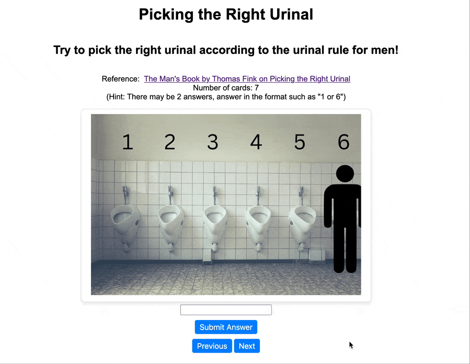

# Web Development Project 3 - _Right Urinal_

Submitted by: **Steven Hsiao**

This web app: **7 flashcards for learning how to pick the right urinal in the men's restroom**

Time spent: **5** hours spent in total

## Required Features

The following **required** functionality is completed:

- [x] **The user can enter their guess in a box before seeing the flipside of the card**
- [x] **Clicking on a submit button shows visual feedback about whether the answer was correct or incorrect**
- [x] **A back button is displayed on the card and can be used to return to the previous card in a set sequence**
- [x] **A next button is displayed on the card and can be used to navigate to the next card in a set sequence**

## Video Walkthrough

Here's a walkthrough of implemented user stories:

<!-- Replace this with whatever GIF tool you used! -->

GIF created with Gifski

<!-- Recommended tools:
[Kap](https://getkap.co/) for macOS
[ScreenToGif](https://www.screentogif.com/) for Windows
[peek](https://github.com/phw/peek) for Linux. -->

## Notes

Form handling is challenging, practice makes perfect.

## License

    Copyright [2024] [Steven Hsiao]

    Licensed under the Apache License, Version 2.0 (the "License");
    you may not use this file except in compliance with the License.
    You may obtain a copy of the License at

        http://www.apache.org/licenses/LICENSE-2.0

    Unless required by applicable law or agreed to in writing, software
    distributed under the License is distributed on an "AS IS" BASIS,
    WITHOUT WARRANTIES OR CONDITIONS OF ANY KIND, either express or implied.
    See the License for the specific language governing permissions and
    limitations under the License.
